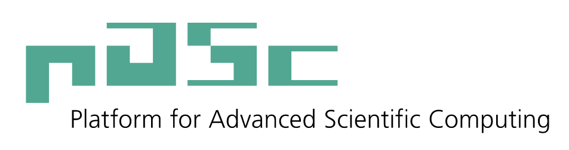

# DLA interface

This is the repository for the DLA (Distributed Linear Algebra) interface code.

# Motivation

The use of the LAPACK and ScaLAPACK libraries for numerical linear algebra is ubiquitous in high-performance computing applications,
and many vendors and software providers use it as the basis of their own high-performance math libraries.
However, there currently exists no distributed GPU-enabled library.
Other packages for linear algebra with GPU support (or without GPU support but with better performances) exist,
but they have different interfaces, therefore major changes in the application code are needed to adopt them.

# Goals

We intend to develop a distributed linear algebra (DLA) interface with the following features:
- The DLA package for each call can be decided at runtime.
- An interface that works with ScaLAPACK matrices.
- Performs matrix layout conversion if needed.

# Potential Benefit

Each Application which uses ScaLAPACK will be able to use the DLA interface with minor changes in the code,
and can benefit from the use of the best performing DLA package to increase the performance of the application.

# DLA Interface

The DLA interface features:
- Communicator utilities
- Matrix class
- DLA routines C++ wrappers (Partially implemented)
- DLA routines Fortran wrappers (Not yet supported)

## List of supported DLA packages

The DLA library supported are:
- ScaLAPACK (MKL, Libsci, Netlib, ...)
- ELPA (Not yet supported)
- D-Plasma (ParSEC) (partially supported, see [limitations](#known-current-limitations))
- Chameleon (StarPU) (Not yet supported)

For more information of which routine of each package is supported see [the list of supported routines](#list-of-supported-dla-packages)

## List of supported routines
- Matrix-matrix multiplication (p\*gemm) (ScaLAPACK, DPlasma)
- Cholesky factorization (p\*potrf) (ScaLAPACK, DPlasma)
- LU factorization (p\*getrf) (ScaLAPACK, DPlasma)

## List of routines with planned support

The routines which will be available are (including the ScaLAPACK corresponding name):
- Matrix-matrix multiplication (p\*gemm)
- Matrix-vector multiplication (p\*gemv)
- Cholesky factorization (p\*potrf)
- LU factorization (p\*getrf)
- Upper/lower triangular matrix inversion (p\*trtri)
- Matrix inversion (LU) (p\*getri)
- Eigenvalue solver (p\*{sy,he}ev{d,x}, p\*geev)
- Solution of linear equations system (p\*gesv)

# Documentation

- [Install](INSTALL.md)
- Cholesky Decomposition:
  - [Example (C++)](miniapp/overlap_gaussian_orbitals.cpp)
  - [Example (C interface)](miniapp/overlap_gaussian_orbitals_c.cpp)
  - Example (Fortran interface) (Not yet available)
- Matrix Multiplication:
  - [Example (C++)](test/extra/matrix_multiplication.cpp)

# Known current limitations

- MKL:
  - The pivot array returned by MKL distributed Cholesky factorization may be wrong for submatrices (when ia or ja are not 0). [Fixed in `MKL-2018u2`.]
  - MKL distributed Matrix multiplication may be wrong for submatrices ("NN" case (both A and B matrices not transposed)). [Fixed in `MKL-2018u2`.]
- Parsec:
  - Thread binding is wrong when multiple rank per node are used. (Parsec Issue #152)
  - Change of the Parsec MPI Communicator sometimes hangs (Parsec Issue #135), therefore only row ordered 2D communicator grids can be used.
- DPLASMA:
  - Matrix multiplication requires consistent block sizes (I.e. A_mb == C_mb, B_nb == C_nb, A_nb == B_mb).
  - LU decomposition requires a (1xq) communicator grid.

# Acknowledgements

The development of DLA-Interface library would not be possible without support of the following organizations (in alphabetic order):

|||
:---:|:---
 | [**CSCS**](https://www.cscs.ch)**: Swiss National Supercomputing Centre**
|||
 | [**ETH Zurich**](https://ethz.ch/en.html)**: Swiss Federal Institute of Technology Zurich**
|||
 | [**PASC**](https://www.pasc-ch.org/)**: Platform for Advanced Scientific Computing**
|||
 | [**PRACE**](https://prace-ri.eu/)**: Partnership for Advanced Computing in Europe** As part of [IP5 WP7](https://prace-ri.eu/about/ip-projects/#PRACE5IP) and [IP6 WP8](https://prace-ri.eu/about/ip-projects/#PRACE6IP)
|||
 | [**ULFME**](https://www.fs.uni-lj.si/en/)**: University of Ljubljana, Faculty of Mechanical Engineering**
|||
